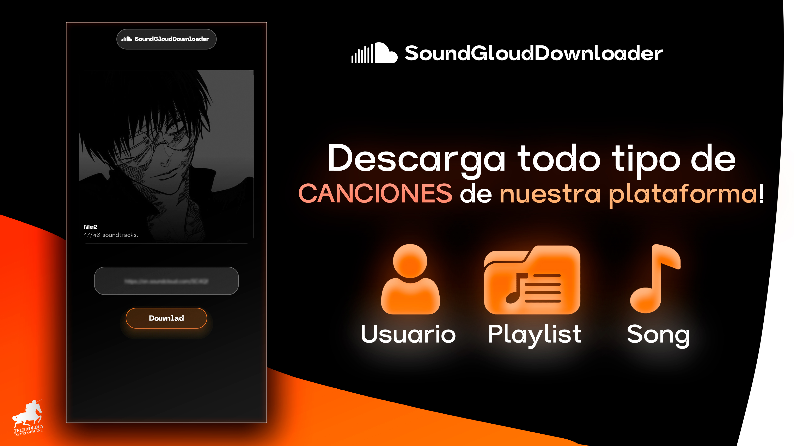
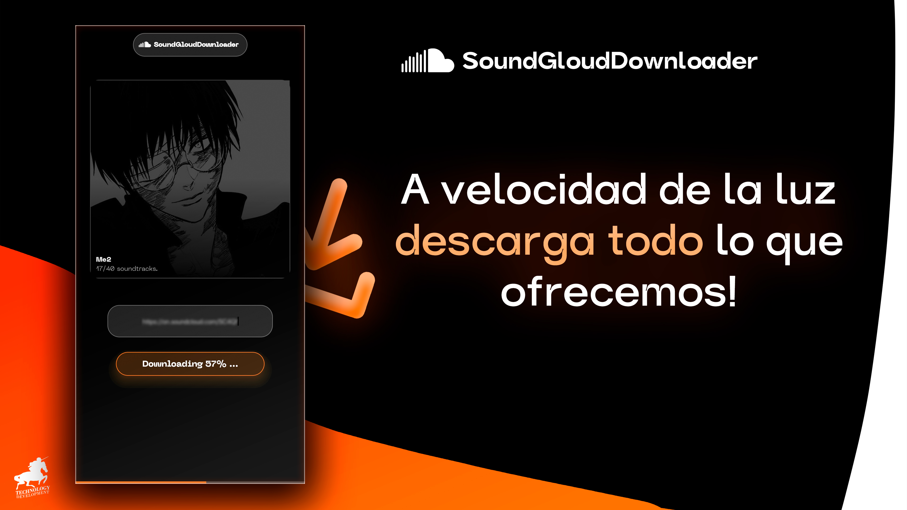
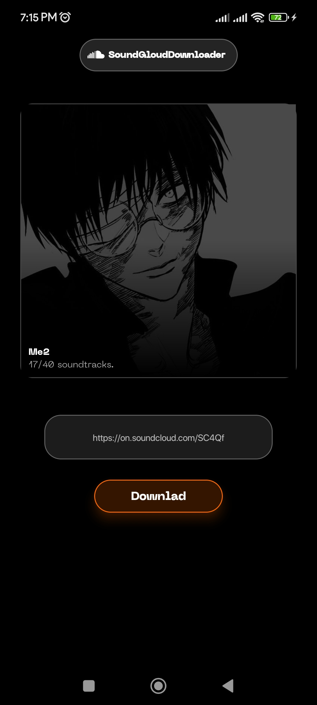
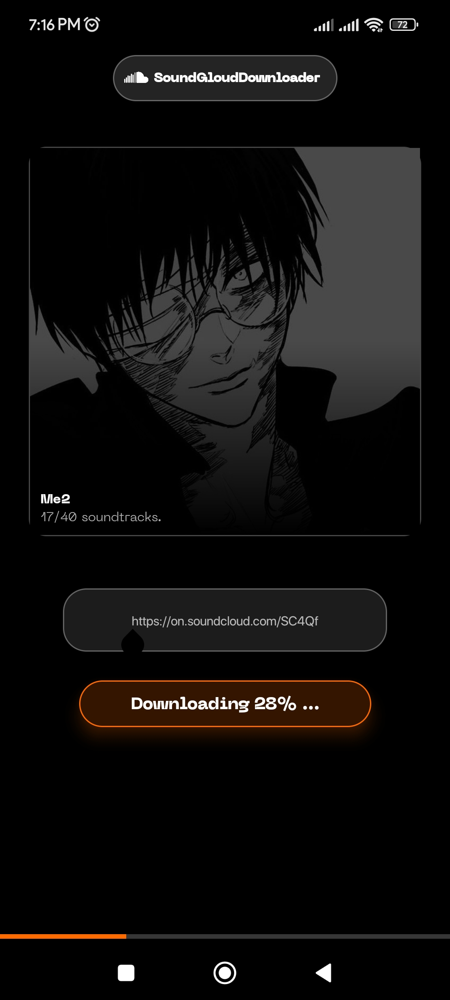
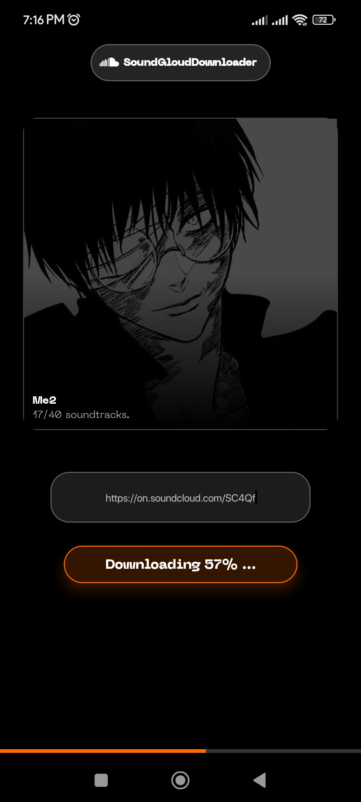

# SoundCloudDownloader

    
    <small style="font-style: italic;">SoundCloudDownloader es una app para descargar música de SoundCloud en alta calidad simplemente pegando el enlace. Rápida, sencilla y perfecta para escuchar tus canciones favoritas sin conexión.</small>

 
<code style="border: 1px solid rgba(0,0,0,.2);"><a href="/docs/README.md" style="font-weight: bold;">Versión en Inglés de este README.</a></code>

---

**SoundCloud Downloader** es una aplicación sencilla y potente que te permite **descargar música directamente de SoundCloud** de forma rápida, segura y sin complicaciones. Diseñada para los amantes de la música que quieren disfrutar de sus canciones favoritas **fuera de línea**, esta herramienta convierte cualquier enlace de SoundCloud en archivos de audio listos para guardar.

#### 🛠️ Características principales:
- 🎵 Descarga canciones individuales o listas de reproducción completas
- ⚡ Interfaz rápida y fácil de usar
- 📁 Archivos MP3 de alta calidad
- 🔗 Solo necesitas el enlace de SoundCloud.

    
    
    

 

    
    
    

