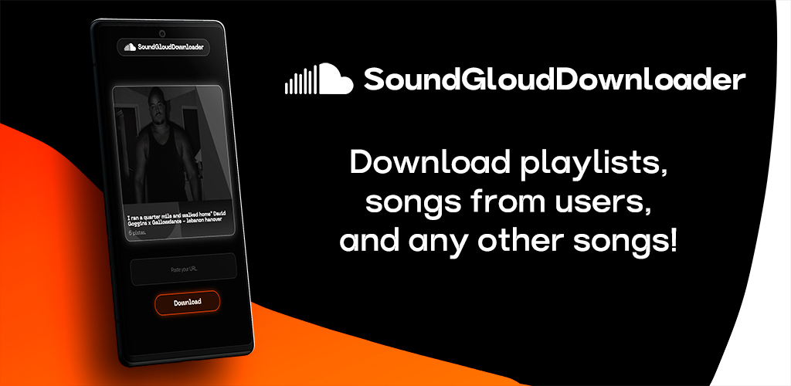

# SoundGloudDownloader

    
    <small style="font-style: italic;">SoundGloudDownloader is an app to download music from SoundCloud in high quality by simply pasting the link. Fast, simple and perfect for listening to your favorite songs offline.</small>

 
<code style="border: 1px solid rgba(0,0,0,.2);"><a href="/docs/README-ES.md" style="font-weight: bold;">Spanish Version of this README.</a></code>

---

**SoundGloud Downloader** is a simple and powerful application that allows you to **download music directly from SoundCloud** quickly, securely and hassle-free. Designed for music lovers who want to enjoy their favorite tracks **offline**, this tool converts any SoundCloud link into ready-to-save audio files.

#### 🛠️ Key features:
- 🎵 Download individual songs or entire playlists
- ⚡ Quick and easy to use interface
- 📁 High quality MP3 files
- 🔗 You just need the SoundCloud link.

    
    
    

 

    
    
    

